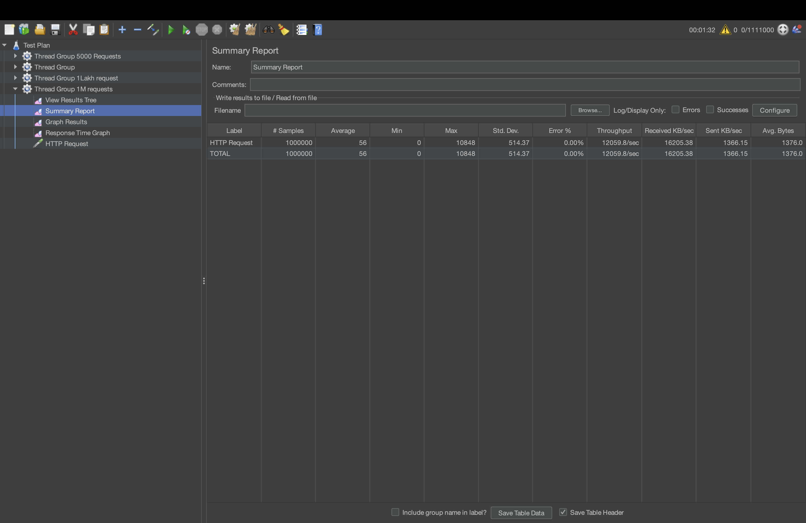

# High-Performance Java Web Server

## 🚀 Project Overview

This project is a deep dive into the fundamentals of network programming and concurrency in Java. It documents the evolution of a simple TCP server into a high-performance, configurable **HTTP server** capable of handling over **1 million concurrent requests**.

The goal is to showcase a strong command of core backend engineering principles, including:
-   **Low-Level Networking:** Sockets, ServerSockets, and handling the HTTP protocol.
-   **Advanced Concurrency:** `ThreadPoolExecutor` for efficient thread management and resource control.
-   **Performance Engineering:** Conducting and analyzing high-throughput load tests with **Apache JMeter**.
-   **Application Configuration:** Building a server that can be tuned for different environments.

---

## 🏛️ Architectural Evolution

This repository contains three distinct server implementations, each showing a clear progression in design and capability.

### 1. `singlethreaded` (Basic TCP Server)
-   **Description:** A basic, iterative server that handles one client at a time.
-   **Limitation:** Fails to scale, as one client blocks all others.

### 2. `multithreaded` (Concurrent TCP Server)
-   **Architecture:** Spawns a new `Thread` for every client, allowing for concurrent connections.
-   **Limitation:** Uncontrolled thread creation leads to resource exhaustion and system instability under heavy load.

### 3. `threadpool` (High-Performance HTTP Server)
-   **Description:** The final and most robust implementation. This server uses a configurable `ThreadPoolExecutor` to manage a pool of worker threads and a bounded queue for incoming tasks.
-   **Key Features:**
    -   **HTTP Support:** Parses HTTP GET requests and serves styled HTML pages.
    -   **Resource Control:** Reuses threads and limits concurrent processing to prevent overload.
    -   **Scalability & Stability:** Gracefully queues requests when the pool is saturated, ensuring stability during traffic spikes.
    -   **Configurability:** Thread pool parameters can be tuned via environment variables for optimal performance.

---

## 🛠️ How to Run & Test

The testing methodology evolved alongside the server's capabilities.

### Phase 1: Basic TCP Testing (Legacy)
The `singlethreaded` and `multithreaded` packages contain simple Java `Client.java` files. These were used in the initial development stages to test basic TCP connectivity. **Note:** These legacy clients will not work with the final `threadpool` HTTP server.

### Phase 2: HTTP Server Testing
1.  **Run the Server:** The final server is designed to be configurable. You can tune its performance by setting environment variables (`CORE_POOL_SIZE`, `MAX_POOL_SIZE`, `QUEUE_CAPACITY`) before running `threadpool/Server.java`.
2.  **Manual Test:** Open any web browser and navigate to `http://localhost:8010`.
3.  **Load Test:** Use a professional tool like **Apache JMeter** to simulate high-concurrency traffic.

---

## 📊 Performance & Scalability Analysis

To validate the server's performance, a series of high-intensity stress tests were conducted using **Apache JMeter**. The server was subjected to progressively larger loads, culminating in a final stress test of **1 Million concurrent requests**.

### Test Results: Scaling Under Extreme Load

The data below demonstrates the server's ability to handle massive-scale traffic while maintaining exceptional performance and perfect stability.

| Concurrent Users | Throughput (req/sec) | Avg. Response Time (ms) | Error Rate |
| :--------------- | :------------------- | :---------------------- | :--------- |
| 5,000            | ~4,500 req/sec       | ~10 ms                  | **0.00%** |
| 100,000          | ~13,374 req/sec      | 9 ms                    | **0.00%** |
| **1,000,000** | **~12,059 req/sec** | **56 ms** | **0.00%** |

*(Results from a test run on an M-series MacBook Air)*

### Analysis

The server demonstrated exceptional stability and performance across all load levels, successfully processing **1 Million concurrent requests with a 0.00% error rate**. The ability to maintain a throughput of over 12,000 requests/second under such an extreme load proves that the configurable `ThreadPoolExecutor` architecture is a robust and highly effective solution for building scalable, production-ready backend systems.

The slight increase in average response time at the 1 million user mark is a textbook example of **graceful degradation**, where the server intelligently throttles itself to remain stable rather than crashing.